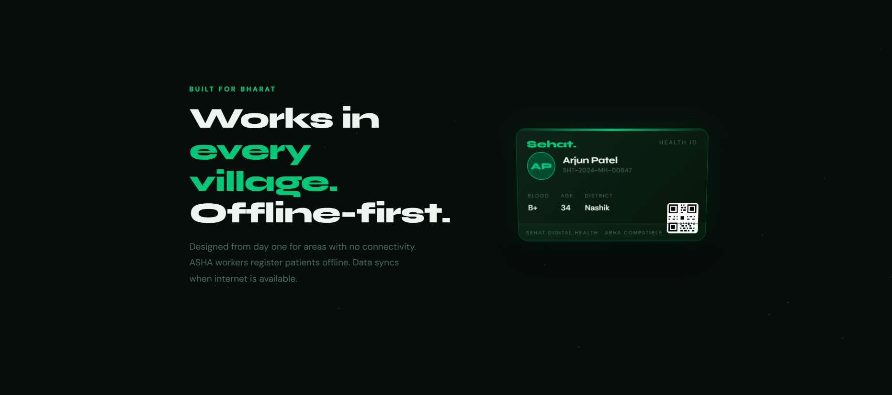

# 🏥 Sehat — Digital Health Identity for Rural India

> **"In rural India, patients don't carry medical records — they carry paper scraps.
> Sehat converts a simple QR code into a lifelong, portable health identity."**

---

## 🌍 The Problem

India has **650,000+ villages**, many with limited or unreliable internet access.
Millions of rural patients still rely on **paper prescriptions and memory** to track their medical history.

This leads to serious issues:

• Paper prescriptions get **lost or damaged**
• Doctors **lack critical patient history during emergencies**
• Rural patients **cannot access digital health systems**
• **Misdiagnosis and treatment delays** occur frequently

In emergency situations, **missing medical information can cost lives.**

---

## 💡 The Solution

**Sehat** is an **offline-first digital health identity system** built for rural healthcare.

Each patient receives a **QR-based health card** that stores essential medical information.

Doctors can **scan the QR code** to instantly access critical health details — even **without internet connectivity**.

---

## ⚡ Dual Access System (Core Innovation)

### 🚨 Emergency Mode (No Authentication)

Designed for **life-saving situations**.

Scanning the QR immediately reveals:

• Blood Group
• Known Allergies
• Critical Medical Conditions
• Emergency Contact

This ensures doctors get **life-saving information instantly**.

---

### 🔒 Private Mode (OTP Protected)

Sensitive medical information is protected through **OTP-based consent**.

Doctors can access:

• Prescription history
• Medications
• Lab reports
• Doctor visit logs
• Full medical history

This ensures **privacy + accessibility**.

---

## 📸 Demo

### Patient Registration



### QR Health Card


### Patient Dashboard


---

## 🌐 Live Demo

Try the working prototype:

👉 https://rudi-rock.github.io/Sehat

---

## ✨ Key Features

📶 **Offline-First Design**
Works even without internet connectivity.

🪪 **QR Health Identity Card**
Each patient receives a unique digital health identity.

👩‍⚕️ **ASHA Worker Friendly**
Patients can be registered by rural healthcare workers.

🔐 **Consent-Based Access**
Full medical records require OTP verification.

📋 **Audit Logs (Planned)**
Patients can see who accessed their health data.

🏛️ **Government Ready**
Designed to integrate with **ABHA / NDHM digital health ecosystem**.

🌍 **Low Literacy Interface**
Simple UI designed for rural populations.

---

## 🛠️ Tech Stack

| Layer           | Technology                |
| --------------- | ------------------------- |
| Frontend        | HTML, CSS, JavaScript     |
| App Type        | Progressive Web App (PWA) |
| QR System       | JavaScript QR Generator   |
| Deployment      | GitHub Pages              |
| Future Backend  | FastAPI                   |
| Future Database | PostgreSQL                |

---

## 📁 Project Structure

```
Sehat/
│
├── README.md
├── index.html
├── register.html
├── dashboard.html
├── manifest.json
│
├── frontend/
│
├── docs/
│   ├── problem.md
│   ├── architecture.md
│   └── roadmap.md
│
├── screenshots/
│
└── icon assets
```

---

## 🧠 Use Case Scenario

A farmer in rural Bihar collapses while working in the field.

He carries a **Sehat QR card**.

A nearby doctor scans the QR code and instantly sees:

• Blood Group: **O+**
• Allergy: **Penicillin**
• Condition: **Diabetes**
• Emergency Contact

Even without internet, the doctor gets **critical life-saving information immediately.**

---

## 🗺️ Roadmap

| Phase   | Codename   | Goal                         |
| ------- | ---------- | ---------------------------- |
| Phase 1 | DART       | QR emergency health identity |
| Phase 2 | POLLYWOG   | Village pilot deployment     |
| Phase 3 | DEMODOG    | Consent + audit system       |
| Phase 4 | DEMOGORGON | Government integration       |

---

## 🚀 Getting Started

Clone the repository:

```
git clone https://github.com/Rudi-rock/Sehat.git
```

Open the project:

```
cd Sehat
```

Run locally:

```
open index.html
```

---

## 🎯 Impact Vision

Sehat aims to become a **national rural health identity system**.

Goal:

**10 million rural patients onboarded in 3 years.**

Ensuring **every Indian — regardless of location or literacy — has access to their own medical identity.**

---

## 🤝 Contributing

We welcome contributors passionate about **healthcare + technology**.

1. Fork the repo
2. Create your feature branch

```
git checkout -b feature/new-feature
```

3. Commit changes

```
git commit -m "Add new feature"
```

4. Push

```
git push origin feature/new-feature
```

5. Open a Pull Request

---

## 📜 License

Distributed under the **MIT License**.

---

## 👨‍💻 Built by Rudra

Created by **Rudra Pratap Singh**
CSE Student — SRM Institute of Science and Technology

Built with the belief that **healthcare information should reach every Indian — not just those in cities.**

---

⭐ **Star this repo if you believe rural healthcare deserves better technology.**

